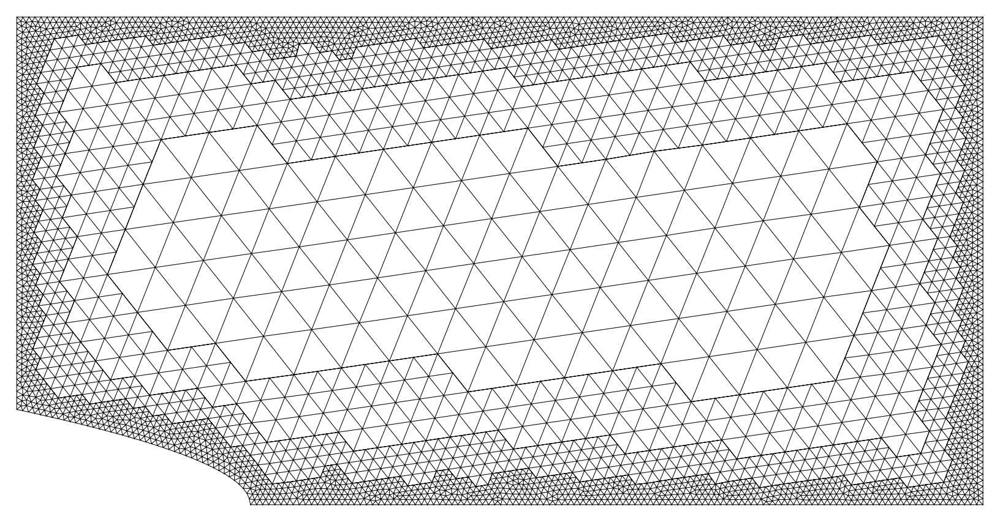
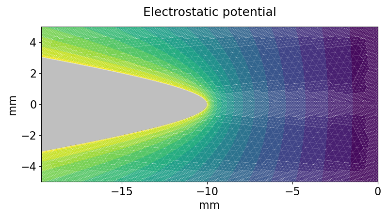

#  triellipt

A lightweight finite-element solver for elliptic and parabolic PDEs.

- Capable of solving steady-state and transient convection-diffusion problems.
- Suitable for basic elliptic problems, such as electrostatics and Helmholtz-type equations.

## Features

**Meshes:**

- Has an interface to read Gmsh meshes  
- Supports [*conforming*](#conforming-mesh) and [*non-conforming*](#non-conforming-mesh) triangle meshes
- Provides a flexible framework for mesh [*adaptation*](#adaptive-mesh)

**Discretization:**

*Methods*

- Continuous Galerkin method 
- Node-centered control-volume finite-element method
- Edge-centered control-volume finite-element method¹

¹ Under construction

*Features*

- Total nodal mass is conserved across adaptive meshes (see details [here](#mass-conservation-test))

## Funding

**Funded by the Deutsche Forschungsgemeinschaft (DFG, German Research Foundation) —
project number [515939493](https://gepris.dfg.de/gepris/projekt/515939493?language=en)**

## Status

- Undergoing usability testing.
- Work on the user guide is in progress.

## Documentation

- ✅ Check the live documentation [here](https://igsemenov.github.io/triellipt/).
- 📄 Check the local source documentation [here](docs/sources/index.md).
- 💾 Offline HTML documentation is available by opening `docs/index.html`.

## Triangle meshes

### Conforming mesh

### Non-conforming mesh

### Adaptive mesh

&nbsp;&nbsp;&nbsp;&nbsp;&nbsp;&nbsp;

### Pin-to-plane mesh

## Examples

### Zernike modes

### Pin-to-plane field

This is the standard electrostatic problem for the pin-to-plane configuration, as considered, for example, in [Celestin et al., *J. Phys. D: Appl. Phys.*, 42(6), 065203 (2009)](https://doi.org/10.1088/0022-3727/42/6/065203).

### Ionization wave

This example shows the evolution of an ionization wave in nitrogen, based on the test case from [Bessières et al., *J. Phys. D: Appl. Phys.*, 40(21), 6559 (2007)](https://doi.org/10.1088/0022-3727/40/21/016). It illustrates the distribution of the absolute electric field within the wave.

&nbsp;&nbsp;

### Mass conservation test

This is an example of a standard mass conservation test used to validate the code.

Two limiting configurations are shown, with the mesh adapted cyclically between them, as demonstrated [here](#adaptive-mesh). A conservative reinterpolation algorithm is used to update the field function defined on the mesh. Details of the algorithm will be provided in a forthcoming paper. The basic features are as follows:

- Algorithm is exact for constant and linear functions
- Total nodal mass is preserved for any mesh-defined function, up to numerical error¹

¹ Stays around machine precision for up to a hundred adaptation cycles

### Convergence test

This is an example of a standard convergence test used to validate the code.

Test features:

- Uses the method of manufactured solutions for verification.
- Applies red-green refinement to a non-conforming mesh.

We consider the Dirichlet problem for the equation

$$
L[u] = \rho
$$

with the operator

$$
L = 1 + \frac{\partial}{\partial x} + \frac{\partial}{\partial y} + \frac{\partial^2}{\partial x^2} + \frac{\partial^2}{\partial y^2}
$$

and the exact solution 

$$
u = \cos(\pi x) \cos(\pi y)
$$

