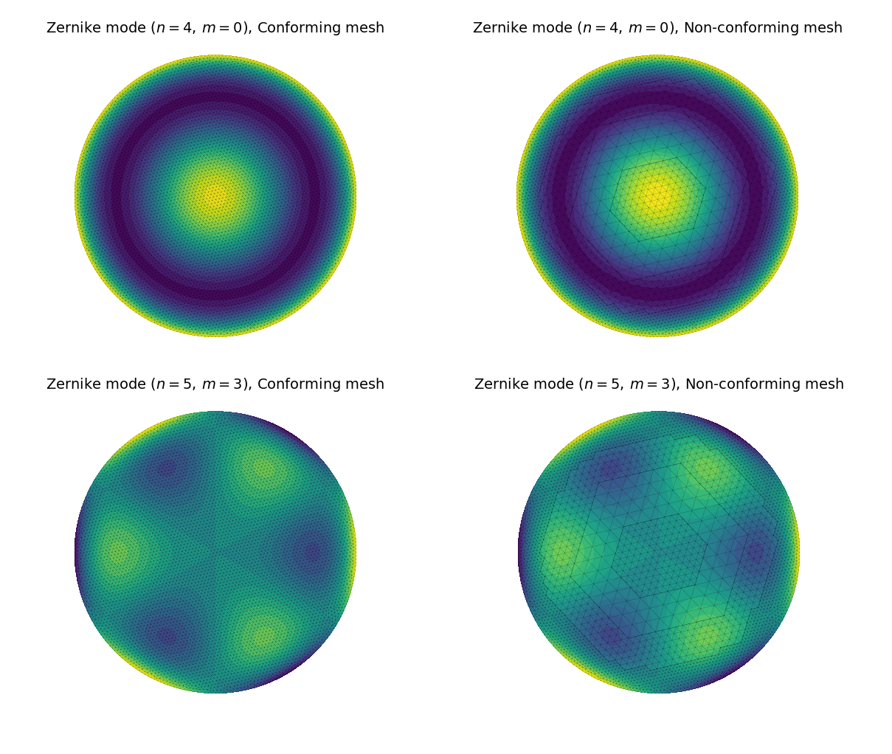
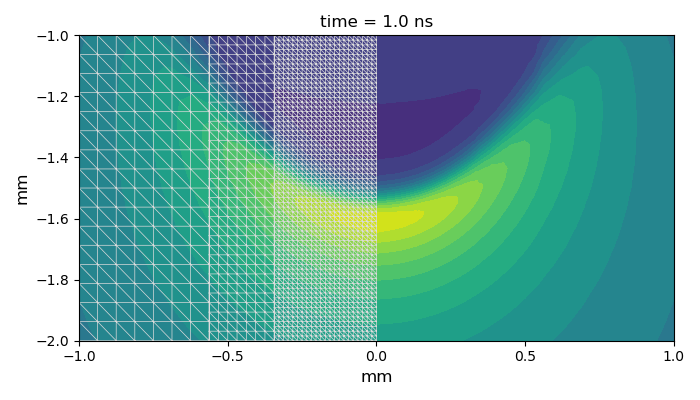
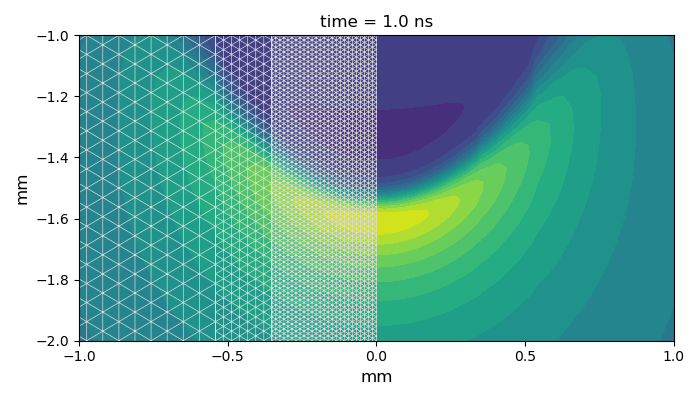

#  triellipt

An adaptive finite-element solver for elliptic and parabolic PDEs.

- Capable of solving steady-state and transient convection-diffusion problems.
- Suitable for basic elliptic problems, such as electrostatics and Helmholtz-type equations.

## Features

**Meshes:**

- Has an interface to read GMSH meshes  
- Supports [*conforming*](#conforming-mesh) and [*non-conforming*](#non-conforming-mesh) triangle meshes
- Provides a flexible framework for mesh [*adaptation*](#adaptive-mesh)

**Discretization:**

*Methods*

- Nodal Continuous Galerkin Method 
- Nodal Finite Volume Element Method
- Edge-based hierarchical Poincaré-Steklov (HPS) scheme¹

¹ Nearing completion and will be available shortly.

*Features*

- Ensures mass conservation on adaptive meshes
- Supports inter-level coupling in *hierarchical discretization* schemes

## Funding

**Funded by the Deutsche Forschungsgemeinschaft (DFG, German Research Foundation) —
project number [515939493](https://gepris.dfg.de/gepris/projekt/515939493?language=en)**

## Status

- Undergoing usability testing.
- Work on the user guide is in progress.

## Documentation

- ✅ Check the live documentation [here](https://igsemenov.github.io/triellipt/).
- 📄 Check the local source documentation [here](docs/sources/index.md).
- 💾 Offline HTML documentation is available by opening `docs/index.html`.

## Triangle meshes

### Conforming mesh

### Non-conforming mesh

### Adaptive mesh

&nbsp;&nbsp;&nbsp;&nbsp;

### Pin-to-plate mesh

## Examples

### Zernike modes

### Ionization wave

&nbsp;

&nbsp;
