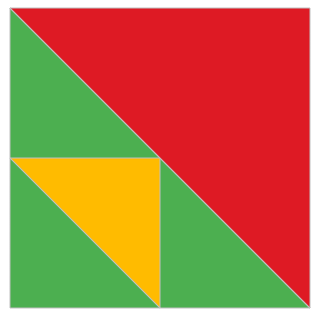
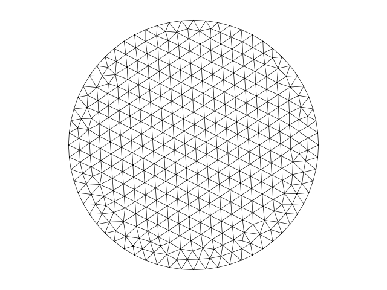
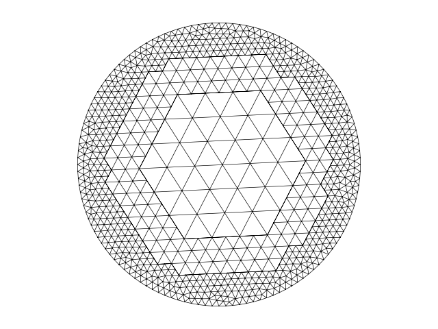

#  triellipt

An adaptive finite-element solver for elliptic PDEs.

## Features

- Solves elliptic PDEs on both [*conformal*](#conformal-triangulation) and [*non-conformal triangulations*](#non-conformal-triangulation).
- Utilizes a locally conservative *control-volume* FEM scheme.
- Has an interface to read GMSH meshes.

## Funding

Funded by the **German Research Foundation (DFG)** —
Project number [515939493](https://gepris.dfg.de/gepris/projekt/515939493?language=en)

## Status

- Undergoing usability testing.
- Work on the user guide is in progress.

## Documentation

View the available documentation here:

- To get an overview of the package, refer to the [local documentation](/docs/sources/index.md).
- Use the offline documentation in HTML by starting with `docs/index.html`.

## Triangulations

### Conformal triangulation

### Non-conformal triangulation

