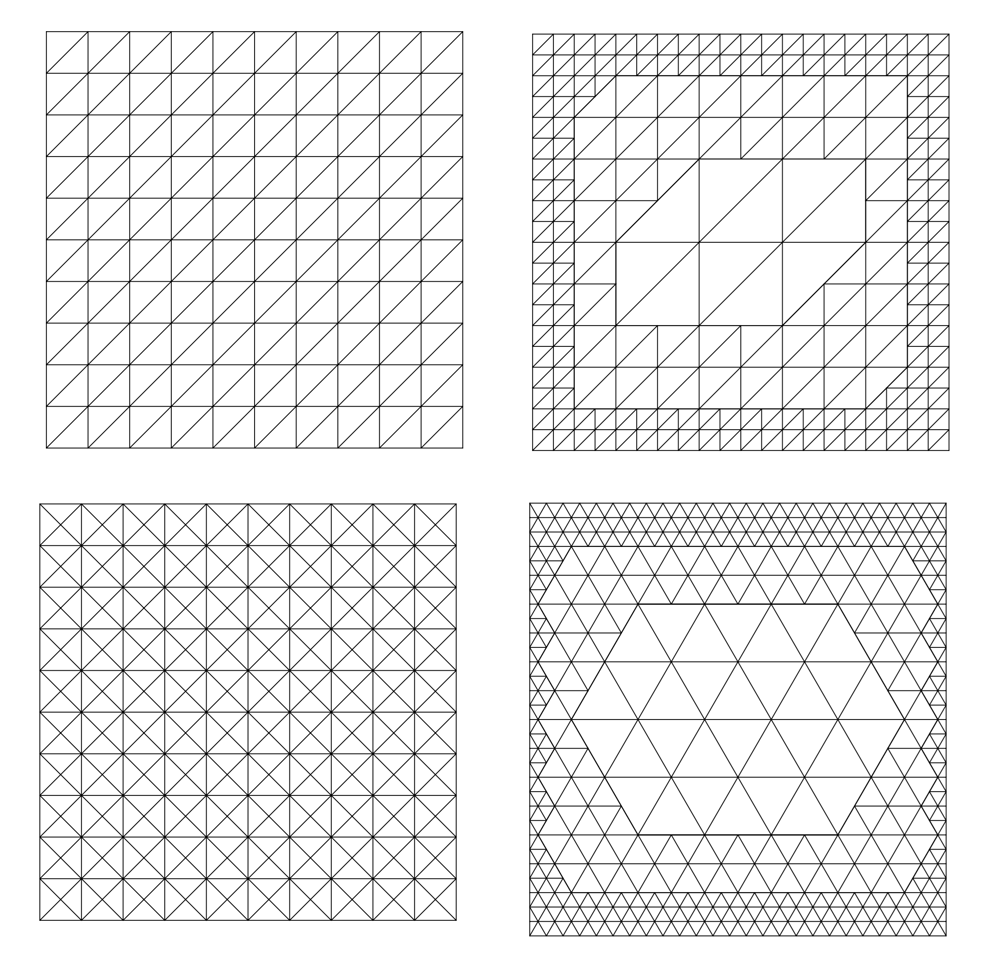

#  triellipt

A lightweight and flexible finite element solver for elliptic and parabolic PDEs.

- Supports steady-state and transient convection–diffusion problems.  
- Suitable for standard elliptic equations, such as electrostatics and Helmholtz-type problems.
- Designed with *domain decomposition* and *boundary condition transfer* techniques in mind.

Explore [features](#features) and [examples](#examples) below.

## Features

**Meshes:**

- Has an interface to read Gmsh meshes.
- Supports [*conforming*](#conforming-mesh) and [*non-conforming*](#non-conforming-mesh) triangle meshes.
- Includes a suite of [*structured*](#structured-meshes) mesh generators.
- Provides a flexible framework for mesh [*adaptation*](#adaptive-mesh).

**Discretization:**

*Methods*

- Continuous Galerkin finite-element method
- Node-centered control-volume finite-element method

🧩 Future development: Edge-centered control-volume finite-element method

*Features*

- Supports conservative reinterpolation of solution fields across adaptive meshes (see details [here](#mass-conservation-test)).

## Funding

**Funded by the Deutsche Forschungsgemeinschaft (DFG, German Research Foundation) —
project number [515939493](https://gepris.dfg.de/gepris/projekt/515939493?language=en)**

## Status

- Undergoing usability testing.
- Work on the user guide is in progress.

## Documentation

- ✅ Check the live documentation [here](https://igsemenov.github.io/triellipt/).
- 📄 Check the local documentation [here](docs/sources/index.md).
- 💾 Offline HTML documentation is available by opening `docs/index.html`.

## Triangle meshes

### Conforming mesh

### Non-conforming mesh

### Adaptive mesh

### Structured meshes

## Examples

### Zernike modes

### Pin-to-plane field

This is the standard electrostatic problem for the pin-to-plane configuration, as considered, for example, in [Celestin et al., *J. Phys. D: Appl. Phys.*, 42(6), 065203 (2009)](https://doi.org/10.1088/0022-3727/42/6/065203).

### Ionization wave

This example shows the evolution of an ionization wave in nitrogen, based on the test case from [Bessières et al., *J. Phys. D: Appl. Phys.*, 40(21), 6559 (2007)](https://doi.org/10.1088/0022-3727/40/21/016). It illustrates the spatial distribution of the electric field within the wave.

### Mass conservation test

This is an example of a standard mass conservation test used to validate the code.

Two limiting configurations are shown, with the mesh adapted cyclically between them, as demonstrated [here](#adaptive-mesh). A conservative reinterpolation algorithm is used to update the field function defined on the mesh. Details of the algorithm will be provided in a forthcoming paper. The basic features are as follows:

- Algorithm is exact for constant and linear functions.
- Total nodal mass is preserved for any mesh-defined function, up to numerical error¹.

¹ Stays around machine precision for up to a hundred adaptation cycles

### Convergence tests

This is an example of a standard convergence test used to validate the code.

Test features:

- Uses the method of manufactured solutions for verification.
- Applies red-green refinement to a non-conforming mesh.

We consider the Dirichlet problem for the equation

$$
L[u] = \rho
$$

in the domain $[-0.5, 0.5]^2$ with the operator

$$
L = 1 + \frac{\partial}{\partial x} + \frac{\partial}{\partial y} + \frac{\partial^2}{\partial x^2} + \frac{\partial^2}{\partial y^2}
$$

and the exact solution 

$$
u = \cos(\pi x) \cos(\pi y)
$$

