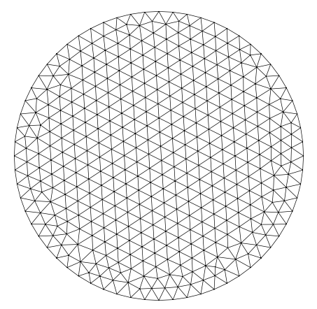
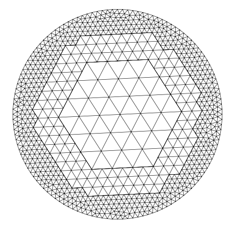
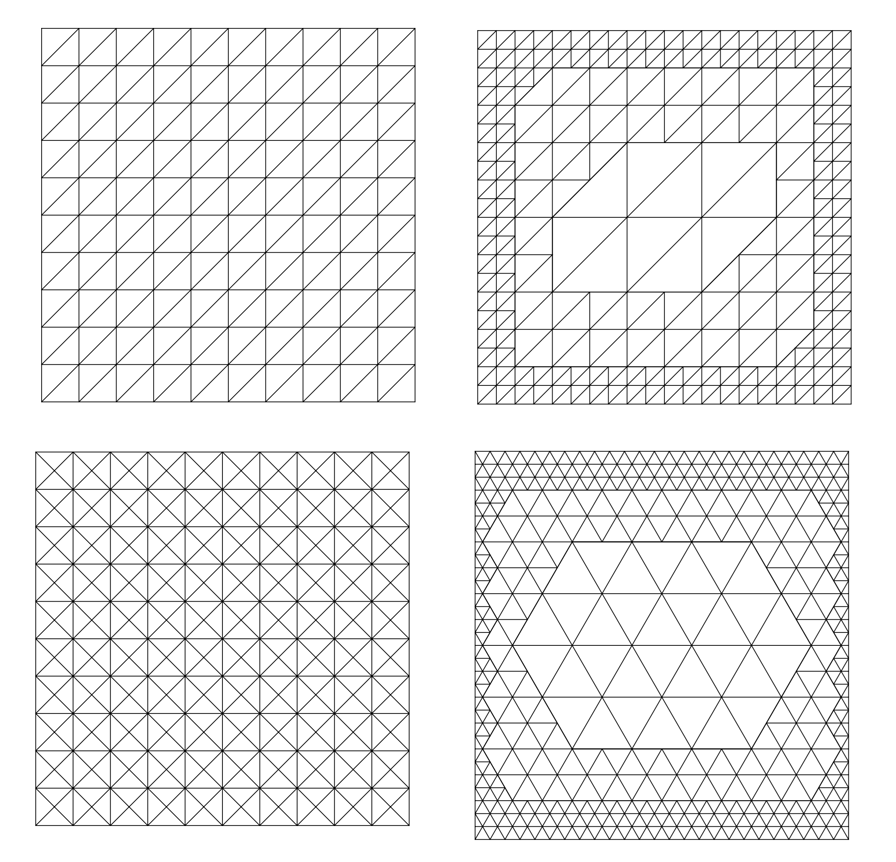
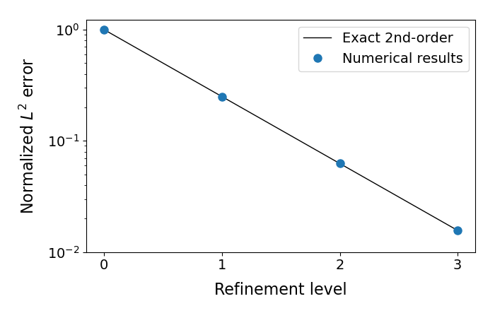

## Triangle meshes

A triangulation with conforming element contacts only:

A triangulation with both conforming and non-conforming element contacts:

An adaptively changing triangle mesh:

Structured triangle meshes:

### Zernike modes

### Convergence tests

This example demonstrates a standard convergence test used to validate the code.

- Uses the method of manufactured solutions for verification.
- Applies red-green refinement to a non-conforming mesh.

We consider the Dirichlet problem for the equation

$$
L[u] = \rho
$$

in the domain $[-0.5, 0.5]^2$, where the operator is given by

$$
L = 1 + \frac{\partial}{\partial x} + \frac{\partial}{\partial y} + \frac{\partial^2}{\partial x^2} + \frac{\partial^2}{\partial y^2},
$$  

and the exact solution is given by  

$$
u(x, y) = \cos(\pi x) \cos(\pi y).
$$

